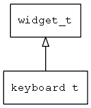

## keyboard\_t
### 概述


 软键盘。

 软键盘是一个特殊的窗口，由编辑器通过输入法自动打开和关闭。

 这里介绍一下定制软键盘的方法：

  编辑器输入类型和软键盘UI资源文件的对应关系:

| 输入类型       | 软键盘UI资源文件|
|----------------|:---------------:|
| INPUT\_PHONE    | kb\_phone.xml    |
| INPUT\_INT      | kb\_int.xml      |
| INPUT\_FLOAT    | kb\_float.xml    |
| INPUT\_UINT     | kb\_uint.xml     |
| INPUT\_UFLOAT   | kb\_ufloat.xml   |
| INPUT\_HEX      | kb\_hex.xml      |
| INPUT\_EMAIL    | kb\_ascii.xml    |
| INPUT\_PASSWORD | kb\_ascii.xml    |
| INPUT\_CUSTOM   | 使用自定义的键盘 |
| 其它            | kb\_default.xml  |

 keyboard中按钮子控件的名称有些特殊要求：

|  名称          | 功能            |
|----------------|:---------------:|
| return         | 回车键          |
| action         | 定制按钮        |
| backspace      | 删除键          |
| tab            | tab键           |
| space          | 空格键          |
| close          | 关闭软键盘      |
| 前缀key:       | 键值            |
| 前缀page:      | 切换到页面      |


 > 更多用法请参考：
 [kb_default](https://github.com/zlgopen/awtk/blob/master/demos/assets/default/raw/ui/kb_default.xml)


----------------------------------
### 函数
<p id="keyboard_t_methods">

| 函数名称 | 说明 | 
| -------- | ------------ | 
| <a href="#keyboard_t_keyboard_cast">keyboard\_cast</a> | 转换为keyboard对象(供脚本语言使用)。 |
| <a href="#keyboard_t_keyboard_close">keyboard\_close</a> | 关闭keyboard窗口。 |
| <a href="#keyboard_t_keyboard_create">keyboard\_create</a> | 创建keyboard对象 |
#### keyboard\_cast 函数
-----------------------

* 函数功能：

> <p id="keyboard_t_keyboard_cast"> 转换为keyboard对象(供脚本语言使用)。


* 函数原型：

```
widget_t* keyboard_cast (widget_t* widget);
```

* 参数说明：

| 参数 | 类型 | 说明 |
| -------- | ----- | --------- |
| 返回值 | widget\_t* | keyboard对象。 |
| widget | widget\_t* | keyboard对象。 |
#### keyboard\_close 函数
-----------------------

* 函数功能：

> <p id="keyboard_t_keyboard_close"> 关闭keyboard窗口。


* 函数原型：

```
ret_t keyboard_close (widget_t* parent);
```

* 参数说明：

| 参数 | 类型 | 说明 |
| -------- | ----- | --------- |
| 返回值 | ret\_t | 返回RET\_OK表示成功，否则表示失败。 |
| parent | widget\_t* | keyboard对象。 |
#### keyboard\_create 函数
-----------------------

* 函数功能：

> <p id="keyboard_t_keyboard_create"> 创建keyboard对象


* 函数原型：

```
widget_t* keyboard_create (widget_t* parent, xy_t x, xy_t y, wh_t w, wh_t h);
```

* 参数说明：

| 参数 | 类型 | 说明 |
| -------- | ----- | --------- |
| 返回值 | widget\_t* | 对象。 |
| parent | widget\_t* | 父控件 |
| x | xy\_t | x坐标 |
| y | xy\_t | y坐标 |
| w | wh\_t | 宽度 |
| h | wh\_t | 高度 |
