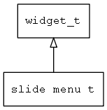

## slide\_menu\_t
### 概述


 左右滑动菜单控件。

 一般用一组按钮作为子控件，通过左右滑动改变当前的项。除了当菜单使用外，也可以用来切换页面。

 slide\_menu\_t是[widget\_t](widget_t.md)的子类控件，widget\_t的函数均适用于slide\_menu\_t控件。

 在xml中使用"slide\_menu"标签创建左右滑动菜单控件。如：

 ```xml
 <slide_menu style="mask" align_v="top">
  <button style="slide_button" text="0"/>
   <button style="slide_button" text="1"/>
   <button style="slide_button" text="2"/>
   <button style="slide_button" text="3"/>
   <button style="slide_button" text="4"/>
 </slide_menu>
 ```

 > 更多用法请参考：[slide_menu.xml](
 https://github.com/zlgopen/awtk/blob/master/demos/assets/default/raw/ui/slide_menu.xml)

 在c代码中使用函数slide\_menu\_create创建左右滑动菜单控件。如：

 ```c
 slide_menu = slide_menu_create(win, 10, 10, 300, 60);
 b = button_create(slide_menu, 0, 0, 0, 0);
 widget_set_text_utf8(b, "1");
 b = button_create(slide_menu, 0, 0, 0, 0);
 widget_set_text_utf8(b, "2");
 b = button_create(slide_menu, 0, 0, 0, 0);
 widget_set_text_utf8(b, "3");
 b = button_create(slide_menu, 0, 0, 0, 0);
 widget_set_text_utf8(b, "4");
 ```

 可按下面的方法关注当前项改变的事件：

 ```c
 widget_on(slide_menu, EVT_VALUE_CHANGED, on_current_changed, slide_menu);
 ```

 可按下面的方法关注当前按钮被点击的事件：

 ```c
 widget_on(b, EVT_CLICK, on_button_click, b);
 ```

 > 完整示例请参考：[slide_menu demo](
 https://github.com/zlgopen/awtk-c-demos/blob/master/demos/slide_menu.c)

 可用通过style来设置控件的显示风格，如背景颜色和蒙版颜色等等。如：

 ```xml
 <style name="mask">
   <normal     bg_color="#f0f0f0" mask_color="#f0f0f0"/>
 </style>
 ```

 > 更多用法请参考：[theme default](
 https://github.com/zlgopen/awtk/blob/master/demos/assets/default/raw/styles/default.xml#L493)


----------------------------------
### 函数
<p id="slide_menu_t_methods">

| 函数名称 | 说明 | 
| -------- | ------------ | 
| <a href="#slide_menu_t_slide_menu_cast">slide\_menu\_cast</a> | 转换slide_menu对象(供脚本语言使用)。 |
| <a href="#slide_menu_t_slide_menu_create">slide\_menu\_create</a> | 创建slide_menu对象 |
| <a href="#slide_menu_t_slide_menu_set_align_v">slide\_menu\_set\_align\_v</a> | 设置垂直对齐方式。 |
| <a href="#slide_menu_t_slide_menu_set_min_scale">slide\_menu\_set\_min\_scale</a> | 设置最小缩放比例。 |
| <a href="#slide_menu_t_slide_menu_set_value">slide\_menu\_set\_value</a> | 设置当前项。 |
### 属性
<p id="slide_menu_t_properties">

| 属性名称 | 类型 | 说明 | 
| -------- | ----- | ------------ | 
| <a href="#slide_menu_t_align_v">align\_v</a> | align\_v\_t | 垂直对齐方式。 |
| <a href="#slide_menu_t_min_scale">min\_scale</a> | float\_t | 最小缩放比例。 |
| <a href="#slide_menu_t_value">value</a> | int32\_t | 值。代表当前选中项的索引。 |
### 事件
<p id="slide_menu_t_events">

| 事件名称 | 类型  | 说明 | 
| -------- | ----- | ------- | 
| EVT\_VALUE\_WILL\_CHANGE | event\_t | 值(当前项)即将改变事件。 |
| EVT\_VALUE\_CHANGED | event\_t | 值(当前项)改变事件。 |
#### slide\_menu\_cast 函数
-----------------------

* 函数功能：

> <p id="slide_menu_t_slide_menu_cast"> 转换slide_menu对象(供脚本语言使用)。


* 函数原型：

```
widget_t* slide_menu_cast (widget_t* widget);
```

* 参数说明：

| 参数 | 类型 | 说明 |
| -------- | ----- | --------- |
| 返回值 | widget\_t* | slide\_menu对象。 |
| widget | widget\_t* | slide\_menu对象。 |
#### slide\_menu\_create 函数
-----------------------

* 函数功能：

> <p id="slide_menu_t_slide_menu_create"> 创建slide_menu对象


* 函数原型：

```
widget_t* slide_menu_create (widget_t* parent, xy_t x, xy_t y, wh_t w, wh_t h);
```

* 参数说明：

| 参数 | 类型 | 说明 |
| -------- | ----- | --------- |
| 返回值 | widget\_t* | 对象。 |
| parent | widget\_t* | 父控件 |
| x | xy\_t | x坐标 |
| y | xy\_t | y坐标 |
| w | wh\_t | 宽度 |
| h | wh\_t | 高度 |
#### slide\_menu\_set\_align\_v 函数
-----------------------

* 函数功能：

> <p id="slide_menu_t_slide_menu_set_align_v"> 设置垂直对齐方式。


* 函数原型：

```
ret_t slide_menu_set_align_v (widget_t* widget, align_v_t align_v);
```

* 参数说明：

| 参数 | 类型 | 说明 |
| -------- | ----- | --------- |
| 返回值 | ret\_t | 返回RET\_OK表示成功，否则表示失败。 |
| widget | widget\_t* | slide\_menu对象。 |
| align\_v | align\_v\_t | 对齐方式。 |
#### slide\_menu\_set\_min\_scale 函数
-----------------------

* 函数功能：

> <p id="slide_menu_t_slide_menu_set_min_scale"> 设置最小缩放比例。


* 函数原型：

```
ret_t slide_menu_set_min_scale (widget_t* widget, float_t min_scale);
```

* 参数说明：

| 参数 | 类型 | 说明 |
| -------- | ----- | --------- |
| 返回值 | ret\_t | 返回RET\_OK表示成功，否则表示失败。 |
| widget | widget\_t* | slide\_menu对象。 |
| min\_scale | float\_t | 最小缩放比例，范围[0.5-1]。 |
#### slide\_menu\_set\_value 函数
-----------------------

* 函数功能：

> <p id="slide_menu_t_slide_menu_set_value"> 设置当前项。


* 函数原型：

```
ret_t slide_menu_set_value (widget_t* widget, uint32_t value);
```

* 参数说明：

| 参数 | 类型 | 说明 |
| -------- | ----- | --------- |
| 返回值 | ret\_t | 返回RET\_OK表示成功，否则表示失败。 |
| widget | widget\_t* | slide\_menu对象。 |
| value | uint32\_t | 当前项的索引。 |
#### align\_v 属性
-----------------------
> <p id="slide_menu_t_align_v"> 垂直对齐方式。


* 类型：align\_v\_t

| 特性 | 是否支持 |
| -------- | ----- |
| 可直接读取 | 是 |
| 可直接修改 | 否 |
| 可持久化   | 是 |
| 可脚本化   | 是 |
| 可在IDE中设置 | 是 |
| 可在XML中设置 | 是 |
| 可通过widget\_get\_prop读取 | 是 |
| 可通过widget\_set\_prop修改 | 是 |
#### min\_scale 属性
-----------------------
> <p id="slide_menu_t_min_scale"> 最小缩放比例。


* 类型：float\_t

| 特性 | 是否支持 |
| -------- | ----- |
| 可直接读取 | 是 |
| 可直接修改 | 否 |
| 可持久化   | 是 |
| 可脚本化   | 是 |
| 可在IDE中设置 | 是 |
| 可在XML中设置 | 是 |
| 可通过widget\_get\_prop读取 | 是 |
| 可通过widget\_set\_prop修改 | 是 |
#### value 属性
-----------------------
> <p id="slide_menu_t_value"> 值。代表当前选中项的索引。


* 类型：int32\_t

| 特性 | 是否支持 |
| -------- | ----- |
| 可直接读取 | 是 |
| 可直接修改 | 否 |
| 可持久化   | 是 |
| 可脚本化   | 是 |
| 可在IDE中设置 | 是 |
| 可在XML中设置 | 是 |
| 可通过widget\_get\_prop读取 | 是 |
| 可通过widget\_set\_prop修改 | 是 |
