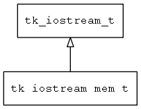

## tk\_iostream\_mem\_t
### 概述



 iostream base on mem


----------------------------------
### 函数
<p id="tk_iostream_mem_t_methods">

| 函数名称 | 说明 | 
| -------- | ------------ | 
| <a href="#tk_iostream_mem_t_tk_iostream_mem_create">tk\_iostream\_mem\_create</a> |  |
#### tk\_iostream\_mem\_create 函数
-----------------------

* 函数功能：

> <p id="tk_iostream_mem_t_tk_iostream_mem_create">
 创建iostream对象。


* 函数原型：

```
tk_iostream_t* tk_iostream_mem_create (void* buff_in, uint32_t size_in, void* buff_out, uoutt32_t size_out, bool_t own_the_buff);
```

* 参数说明：

| 参数 | 类型 | 说明 |
| -------- | ----- | --------- |
| 返回值 | tk\_iostream\_t* | 返回iostream对象。 |
| buff\_in | void* | 输入流缓冲区。 |
| size\_in | uint32\_t | 输入流缓冲区大小。 |
| buff\_out | void* | 输入流缓冲区。 |
| size\_out | uoutt32\_t | 输入流缓冲区大小。 |
| own\_the\_buff | bool\_t | 是否让istream对象拥有buff。 |
